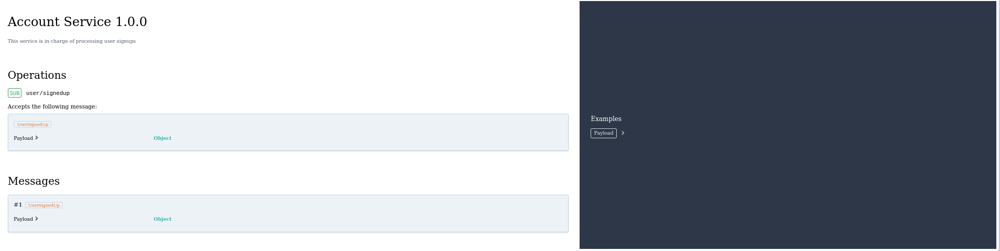

# asyncapi-docs-rendering-examples
## Examples of how you can generate documentation using the AsyncApi component.

asyncapiReact, asyncapiVue, webcomponent and standalone bundle are Client-Side Rendering(CSR) examples.

I used below test AsyncAPI sample file for each of the examples. 
Only React template was fetched, every other model was pasted.

```
`
{
  "asyncapi": "2.2.0",
  "info": {
    "title": "Account Service",
    "version": "1.0.0",
    "description": "This service is in charge of processing user signups"
  },
  "channels": {
    "user/signedup": {
      "subscribe": {
        "message": {
          "$ref": "#/components/messages/UserSignedUp"
        }
      }
    }
  },
  "components": {
    "messages": {
      "UserSignedUp": {
        "payload": {
          "type": "object",
          "properties": {
            "displayName": {
              "type": "string",
              "description": "Name of the user"
            },
            "email": {
              "type": "string",
              "format": "email",
              "description": "Email of the user"
            }
          }
        }
      }
    }
  }
}
`
```
If everything works like it should, then each of these examples should generate this AsyncAPI template 👇.



